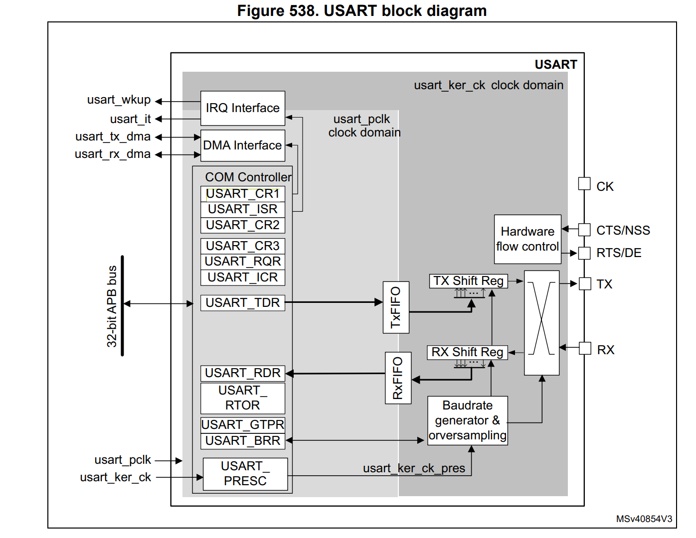

                                                         
                                                         
### ESP32 for later followup

##### Autobaud

UART_LOWPULSE_MIN_CNT stores minimum low-pulse width, UART_HIGHPULSE_MIN_CNT stores
minimum high-pulse width.

By reading these two registers, software can calculate the baud rate of the
transmitter.
So you have to calculate and set the baud yourself based on those values, it is not really "auto".


##### Maximum baud rate
The fact that 2M baud seems to communicate well, yet flashing only runs at 825.8 kbit/s leads me to believe that there's a bottleneck at the flash writing, but I can't seem to find any documentation of a maximum flashing speed.


 # STM32 Random examples

### Uart Examples

##### Polled

```
#include "main.h"
 
uint8_t UART1_rxBuffer[12] = {0};
 
UART_HandleTypeDef huart1;
 
void SystemClock_Config(void);
static void MX_GPIO_Init(void);
static void MX_USART1_UART_Init(void);
 
int main(void)
{
    HAL_Init();
    SystemClock_Config();
    MX_GPIO_Init();
    MX_USART1_UART_Init();
 
    HAL_UART_Receive (&huart1, UART1_rxBuffer, 12, 5000);
    HAL_UART_Transmit(&huart1, UART1_rxBuffer, 12, 100);
    
    while (1)
    {
 
    }
 
}
```
 ##### Interrupt
```
#include "main.h"
 
uint8_t UART1_rxBuffer[12] = {0};
 
UART_HandleTypeDef huart1;
 
void SystemClock_Config(void);
static void MX_GPIO_Init(void);
static void MX_USART1_UART_Init(void);
 
int main(void)
{
    HAL_Init();
    SystemClock_Config();
    MX_GPIO_Init();
    MX_USART1_UART_Init();
 
    HAL_UART_Receive_IT (&huart1, UART1_rxBuffer, 12);
 
    while (1)
    {
 
    }
 
}
 
void HAL_UART_RxCpltCallback(UART_HandleTypeDef *huart)
{
    HAL_UART_Transmit(&huart1, UART1_rxBuffer, 12, 100);
    HAL_UART_Receive_IT(&huart1, UART1_rxBuffer, 12);
}
```

####  DMA

```
#include "main.h"
 
uint8_t UART1_rxBuffer[12] = {0};
 
UART_HandleTypeDef huart1;
DMA_HandleTypeDef hdma_usart1_rx;
 
void SystemClock_Config(void);
static void MX_GPIO_Init(void);
static void MX_DMA_Init(void);
static void MX_USART1_UART_Init(void);
 
int main(void)
{
    HAL_Init();
    SystemClock_Config();
    MX_GPIO_Init();
    MX_DMA_Init();
    MX_USART1_UART_Init();
 
    HAL_UART_Receive_DMA (&huart1, UART1_rxBuffer, 12);
 
    while (1)
    {
 
    }
 
}
 
void HAL_UART_RxCpltCallback(UART_HandleTypeDef *huart)
{
    HAL_UART_Transmit(&huart1, UART1_rxBuffer, 12, 100);
    HAL_UART_Receive_DMA(&huart1, UART1_rxBuffer, 12);
}

```





### How to properly enable/disable interrupts in ARM Cortex-M?

Point of this post is not how to use NVIC (Nested Vectored Interrupt Controller) in Cortex-M processors but how to disable/enable interrupts properly for your system to avoid strange behaviours in your code.

Let’s assume you have 2 functions, which do some important stuff and they have to make sure that noone interrupts these 2 functions

```void ImportantFunction1(void) {
    /* Important function 1 */
    
    /* Do some stuff here which can be interrupted */
    
    /* Disable interrupts */
    __disable_irq();
    
    /* Do some stuff here which can not be interrupted */
    
    /* Enable interrupts back */
    __enable_irq();
    
    /* Do some stuff here which can be interrupted */
}
 
void ImportantFunction2(void) {
    /* Important function 2 */
    
    /* Do some stuff here which can be interrupted */
    
    /* Disable interrupts */
    __disable_irq();
    
    /* Do some stuff here which can not be interrupted */
    
    /* Enable interrupts back */
    __enable_irq();
    
    /* Do some stuff here which can be interrupted */
}
```
By calling these 2 functions from some other function, this will just work properly, interrupts will be disabled, important stuff done and interrupts enabled again. But what if you come to a situation, when important function 1 calls important function 2 from section where function 1 should not be interrupted? In case above, important function 2 would enable interrupts back and function 1 would not be safe anymore. Check example below which will fail in order to make clean and safe program:

```
void ImportantFunction1(void) {
    /* Important function 1 */
    
    /* Do some stuff here which can be interrupted */
    
    /* Disable interrupts */
    __disable_irq();
    
    /* Do some stuff here which can not be interrupted */
    
    /* Call subfunction */
    ImportantFunction2();
    
    /* Do some stuff here which can not be interrupted */
    /* Here is a problem, ImportantFunction2() also enables interrupts */
    /* This part here is not safe from interrupts anymore and can be interrupted */
    
    /* Enable interrupts back */
    __enable_irq();
    
    /* Do some stuff here which can be interrupted */
}
 
void ImportantFunction2(void) {
    /* Important function 2 */
    
    /* Do some stuff here which can be interrupted */
    
    /* Disable interrupts */
    __disable_irq();
    
    /* Do some stuff here which can not be interrupted */
    
    /* Enable interrupts back */
    __enable_irq();
    
    /* Do some stuff here which can be interrupted */
}


void ImportantFunction1(void) {
    /* Important function 1 */
    uint32_t prim;
    
    /* Do some stuff here which can be interrupted */
    
    /* Read PRIMASK register, check interrupt status before you disable them */
    /* Returns 0 if they are enabled, or non-zero if disabled */
    prim = __get_PRIMASK();
    
    /* Disable interrupts */
    __disable_irq();
    
    /* Do some stuff here which can not be interrupted */
    
    /* Call subfunction */
    ImportantFunction2();
    
    /* Do some stuff here which can not be interrupted */
    /* This part is still interrupt safe because ImportantFunction2 will not enable interrupts */
    
    /* Enable interrupts back */
    if (!prim) {
        __enable_irq();
    }
    
    /* Do some stuff here which can be interrupted */
}
 
void ImportantFunction2(void) {
    /* Important function 2 */
    uint32_t prim;
    
    /* Do some stuff here which can be interrupted */
    
    /* Read PRIMASK register, check interrupt status before you disable them */
    /* Returns 0 if they are enabled, or non-zero if disabled */
    prim = __get_PRIMASK();
    
    /* Disable interrupts */
    __disable_irq();
    
    /* Do some stuff here which can not be interrupted */
    
    /* Enable interrupts back only if they were enabled before we disable it here in this function */
    if (!prim) {
        __enable_irq();
    }
    
    /* Do some stuff here which can be interrupted */
}

```


### -----------

STM32 - Interrupt management
All microcontrollers provide a feature called interrupts. An interrupt is an asynchronous event that causes stopping the execution of the current code on a priority basis. Interrupts originate by the hardware and the software itself, and can be controlled via a Nested Vectored Interrupt Controller.

#arm #stm32 #interrupt

1. NVIC Controller
Nested Vectored Interrupt Controller (NVIC) is a method of prioritizing interrupts, improving the MCU’s performance and reducing interrupt latency. NVIC also provides implementation schemes for handling interrupts that occur when other interrupts are being executed or when the CPU is in the process of restoring its previous state and resuming its suspended process.


NVIC module in STM32 MCUs
Clock Security System (CSS) interrupt is connected to Non-Maskable Interrupt (NMI) lines
Peripheral interrupts are connected to Interrupt Requests (IRQ) lines
GPIO interrupts are connected to an External Interrupt/Event Controller (EXTI) before connecting to the IRQ lines

External Interrupt lines
External Interrupts are grouped by lines which connect to GPIO. As processor may have many GPIOs, an EXTI line is shared by multiple pins. In one line (group), only one pin can be set to generate interrupt, and software must be able to discriminate which lines generated the interrupt. The external interrupt can be fired on rising edge, or falling edge, or both.

Whenever an interrupt happens, the processor stops the current code, and handle the interrupt by running an Interrupt Service Routines (ISR) which is located in a pre-defined table called Vector Interrupt Table (VIC).

Number	Exception Type	Priority	Function
1	Reset	-3	Reset
2	NMI	-2	Non-Maskable Interrupt
3	Hard Fault	-1	All faults that hang the processor
4	Memory Fault	Configurable	Memory issue
5	Bus Fault	Configurable	Data bus issue
6	Usage Fault	Configurable	Data bus issue
7 ~ 10	Reserved	—	Reserved
11	SVCall	Configurable	System service call (SVC instruction)
12	Debug	Configurable	Debug monitor (via SWD)
13	Reserved	—	Reserved
14	PendSV	Configurable	Pending request for System Service call
15	SysTick	Configurable	System Timer
16 ~ 240	IRQ	Configurable	Interrupt Request

Show more
This table is declared in assembly code in the startup file of MCU startup_*.s.

startup_stm32f051r8tx.s

g_pfnVectors:
 .word _estack
 .word Reset_Handler
 .word NMI_Handler
 .word HardFault_Handler
 .word 0
 .word 0
 .word 0
 .word 0
 .word 0
 .word 0
 .word 0
 .word SVC_Handler
 .word 0
 .word 0
 .word PendSV_Handler
 .word SysTick_Handler
 .word WWDG_IRQHandler                /* Window WatchDog              */
 .word PVD_IRQHandler                 /* PVD through EXTI Line detect */
 .word RTC_IRQHandler                 /* RTC through the EXTI line    */
 .word FLASH_IRQHandler               /* FLASH                        */
 .word RCC_CRS_IRQHandler             /* RCC and CRS                  */
 .word EXTI0_1_IRQHandler             /* EXTI Line 0 and 1            */
 .word EXTI2_3_IRQHandler             /* EXTI Line 2 and 3            */
 .word EXTI4_15_IRQHandler            /* EXTI Line 4 to 15            */
 .word TSC_IRQHandler                 /* TSC                          */
 .word DMA1_Channel1_IRQHandler       /* DMA1 Channel 1               */
 .word DMA1_Channel2_3_IRQHandler     /* DMA1 Channel 2 and Channel 3 */
 .word DMA1_Channel4_5_IRQHandler     /* DMA1 Channel 4 and Channel 5 */
 .word ADC1_COMP_IRQHandler           /* ADC1, COMP1 and COMP2        */
 .word TIM1_BRK_UP_TRG_COM_IRQHandler /* TIM1 Break/Update/Trigger/Commutation */
 .word TIM1_CC_IRQHandler             /* TIM1 Capture Compare         */
 .word TIM2_IRQHandler                /* TIM2                         */
 .word TIM3_IRQHandler                /* TIM3                         */
 .word TIM6_DAC_IRQHandler            /* TIM6 and DAC                 */
 .word 0                              /* Reserved                     */
 .word TIM14_IRQHandler               /* TIM14                        */
 .word TIM15_IRQHandler               /* TIM15                        */
 .word TIM16_IRQHandler               /* TIM16                        */
 .word TIM17_IRQHandler               /* TIM17                        */
 .word I2C1_IRQHandler                /* I2C1                         */
 .word I2C2_IRQHandler                /* I2C2                         */
 .word SPI1_IRQHandler                /* SPI1                         */
 .word SPI2_IRQHandler                /* SPI2                         */
 .word USART1_IRQHandler              /* USART1                       */
 .word USART2_IRQHandler              /* USART2                       */
 .word 0                              /* Reserved                     */
 .word CEC_CAN_IRQHandler             /* CEC and CAN                  */
 .word 0                              /* Reserved                     */
By convention, the vector table starts at the hardware address 0x00000000 in all Cortex-M based processors. If the vector table resides in the internal flash memory (this is what usually happens), and since the flash in all STM32 MCUs is mapped from 0x08000000 address, it is placed starting from the 0x08000000 address, which is aliased to 0x00000000 when the CPU boots up.

Read about the Boot mode in the Reference Manual

Entry zero of this array is the address of the Main Stack Pointer (MSP) inside the SRAM. Usually, this address corresponds to the end of the SRAM _estack.


Vector Interrupt Table in ARM cores
2. Processor Mode
The processor mode can change when exceptions occur. And it can be in one of the following modes:

Thread Mode: Which is entered on reset, and application run on this mode.
Handler Mode: Which is entered on all other exceptions
The interrupt entry and exit are hardware implemented in order to reduce the latency and speed up the response. The hardware will do:

Automatically saves and restores processor context (registers, flags)
Allows late determination of the highest priority pending interrupt
Allows another pending interrupt to be serviced without a full restore/save for processor context (this feature is called tail-chaining)
3. Preemption
The Preemption happens when a task is abandoned (gets interrupted) in order to handle an exception. The currently running instruction stream is said to be Preempted. When multiple exceptions with the same priority levels are pending, the one with the lowest exception number gets serviced first. And once an exception is active and being serviced by the processor, only exceptions with a higher priority level can Preempt it.

Lower priority level has higher priority of execution.

Consider the following example, where 3 exceptions/interrupts are fired with different priority levels. IRQ1 Preempted IRQ2 and forced IRQ3 to pend until IRQ1 completion. After IRQ1 ISR completion, ISR2 continues where it left off when IRQ1 Preempted it. And finally, after ISR2 completion, ISR3 starts executions. And the context is restored to the main program (foreground).


Preemption allow IRQ1 to be executed
4. Interrupts Tail-Chaining
When an interrupt (exception) is fired, the main (foreground) code context is saved (pushed) to the stack and the processor branches to the corresponding interrupt vector to start executing the ISR handler. At the end of the ISR, the context saved in the stack is popped out, so the processor can resume the main (foreground) code instructions. However, and if a new exception is already pended, the context push & pop are skipped. And the processor handler the second ISR without any additional overhead. This is called Tail-Chaining.

And it requires 6 cycles on Cortex-M3/M4 processors. Which is a huge speedup in the performance and enhanced the interrupt response time greatly (reduces the interrupt latency). Here is an example of what happens if the CPU receives a 2nd interrupt request (IRQ2) while it’s servicing the 1st one (IRQ1).


Tail chaining when IRQ2 comes while IRQ1 is executing
5. Interrupt Late Arrival
The ARM core can detect a higher priority exception while in the exception entry phase (stacking caller registers & fetching the ISR routine vector to be executed) of another exception. A late arriving interrupt is detected during this period. The higher priority ISR can be fetched and executed but the context saving that has been already done can be skipped. This reduces the latency for the higher priority interrupt and, upon completion of the late-arriving exception handler, the processor can then tail-chain into the initial exception that was going to be serviced (the lower priority one).


Late arrival is detected when IRQ1 comes while IRQ2 is about to start
A pending higher-priority exception is handled before an already pending lower-priority exception even after the exception entry sequence has started. The lower-priority exception is handled after the higher-priority exception.

6. Interrupt Lifecycle
An interrupt can:

Either be disabled (default behavior) or enabled;
either be pending (a request is waiting to be served) or not pending;
either be in an active (being served) or inactive state.
When an interrupt fires, it is marked as pending until the processor can serve it. If no other interrupts are currently being processed, it’s pending state is automatically cleared by the processor, then it starts get served.


ISR A then ISR B
The lower priority ISR has to wait in pending state until no higher priority ISR is being processed. It can be put into inactive state when it is preempted by a higher priority ISR.


ISR A preempts ISR B
An interrupt can be forced to fire again during its execution, simply setting its pending bit again. In the same way, the execution of an interrupt can be canceled clearing its pending bit while it is in pending state


ISR A then ISR A

ISR B canceled
7. Reset Behavior
When a reset occurs (Reset input is asserted):

The MSP (main stack pointer) register loads the initial value from the address 0x00000000 which contains the end address of RAM _estack
The reset handler address is loaded from address 0x00000004.
The reset handler gets executed in thread mode.
The reset handler branches to the main program.
8. Exception Behavior
When an exception occurs, the current instruction stream is stopped and the processor accesses the exceptions vector table:

The vector address of that exception is loaded from the vector table.
The exception handler starts to be executed in handler mode.
The exception handler returns to main (assuming no further nesting).
Here are more details:


1. Interrupt Stacking (Context Saving)

The processor will finish the current instruction as long as it’s not a multi-cycle instruction
The processor state (context) is automatically saved to the stack. Eight registers are pushed (PC, R0-R3, R12, LR, xPSR).
During or after context saving, the address of the corresponding ISR is loaded from the exception/interrupt vector table
The link register is modified for return after interrupt
The first instruction of the ISR starts to be executed by the CPU. For Cortex-M3/M4, the whole latency this process takes is 12 cycles. However, IRQ latency is improved if late-arrival or tail-chaining has occurred.

2. Interrupt Service Routine (ISR) Handling

ISR should clear the interrupt source flag if required
Interrupt nesting won’t affect the way the ISR is written however, attention should be paid to the main stack overflow that may occur.
Given that certain exceptions/interrupts are to be serviced hundreds or thousands of times per second. So it must run so quickly and no delays are permitted within ISR handlers

3. Return From ISR (Context Restoration)

Detect tail-chaining interrupt, if you have, call to the ISR without restoring the context to speed up
The EXC_RETURN instruction is fetched and gets executed to restore the PC and pop the CPU registers.
The return from interrupt (context restoration) on ARM Cortex-M3/M4 requires 10 clock cycles
9. The Peripheral Pending bit
When an interrupt takes place, the most of STM32 peripherals assert a specific signal connected to the NVIC, which is mapped in the peripheral memory through a dedicated bit. This Peripheral Pending bit will be held high until it is manually cleared by the application code.

The ISR Pending bit is different to the Peripheral Pending bit. When the processor starts servicing the ISR, the ISR pending bit is cleared automatically, but the peripheral IRQ pending bit will be held high until it is cleared by the application code.

If the Peripheral Pending bit is not clear, the interrupt will be fired again and the ISR will run again

It is able to manually set the Peripheral Pending bit to force the ISR run


External Peripheral Pending set

Manually Peripheral Pending set
10. Configure Interrupts
After a reset:

When an STM32 MCU boots up, only Reset, NMI and Hard Fault exceptions are enabled by default. The rest of exceptions and peripheral interrupts are disabled, and they have to be enabled on request.


When configuring a peripheral to work in Interrupt mode, the user application has to:

Enable interrupt on the interrupt line, e.g. pin PA0 on the EXTI0 line
Implement the interrupt handler which is declared in the startup file, e.g. EXTI0_1_IRQHandler for handle EXTI Line 0 and 1
Inside the handle:
Check the interrupt source
Clear interrupt flag
Call a callback if needed
11. STM32CubeMX Usage
NVIC can be configured using STM32CubeMX, in the Pinout & Configuration tab. This screen list all interrupts in the system and provides options to set up interrupts:

Enable or Disable an interrupt: as mentioned above, some interrupts are always enabled, such as NMI, Hard fault, SVC. Note that STM32CubeMX forces to enable SysTick because HAL needs it to handle delay functions
Set Preemption Priority for each interrupt
Generate IRQ handlers (in *_it.c) and call to HAL callbacks those will clear the pending bit, do something, and finally will call to a weak callback which can be overridden by users.
Interrupt can be configured in each peripheral setting screen. For example, if user enables an external interrupt on a pin, NVIC tab will be available to quickly enable or disable the peripheral interrupt.


NVIC configuration in STM32CubeMX
12. STM32CubeHAL Usage
To enable an IRQ, the STM32CubeHAL provides the following function:

void HAL_NVIC_EnableIRQ(IRQn_Type IRQn);

Where the IRQn_Type is an enumeration of all exceptions and interrupts defined for that specific MCU. The IRQn_Type enum is part of the ST Device HAL, and it is defined inside a header file specific for the given STM32 MCU named stm32fxxxx.h. For example, for an STM32F030R8 MCU the right filename is stm32f030x8.h (the pattern name of these files is the same of start-up files).

The corresponding function to disable an IRQ is the:

void HAL_NVIC_DisableIRQ(IRQn_Type IRQn);

Note that the above function enable the interrupt line at the NVIC level. A single peripheral must be properly configured to work in interrupt mode to cause it assert the corresponding peripheral interrupt level.

Configure the NVIC Priority Grouping using HAL_NVIC_SetPriorityGrouping() function if using Group Priority, then use HAL_NVIC_SetPriority() to set the priority of the selected IRQ.

 

When the NVIC_PRIORITYGROUP_0 is selected, IRQ preemption is no more possible. The pending IRQ priority will be managed only by the sub priority.

Since the presence of the IRQ pending bit is peripheral dependent, it is a good design practice to clear peripherals IRQ pending status bit as their ISR start to be serviced. The processor core does not keep track of multiple interrupts (it does not queue interrupts), so if clearing the peripheral pending bit at the end of an ISR may lose important IRQs that fire in the middle.

To see if an interrupt is pending (that is, fired but not running):

uint32_t HAL_NVIC_GetPendingIRQ(IRQn_Type IRQn);

To programmatically set the pending bit of an IRQ which causes the interrupt to fire, as it would be generated by the hardware:

void HAL_NVIC_SetPendingIRQ(IRQn_Type IRQn);

Instead, to programmatically clear the pending bit of an IRQ

void HAL_NVIC_ClearPendingIRQ(IRQn_Type IRQn);

To check if an ISR is active (IRQ being serviced):

uint32_t HAL_NVIC_GetActive(IRQn_Type IRQn);