https://deepbluembedded.com/stm32-usart-uart-tutorial/

## STM32 USART

________________________________________
### USART / UART Hardware In STM32   
 
#### STM32 USART Highlights
The universal synchronous asynchronous receiver transmitter (USART) offers a flexible means of full-duplex data exchange with external equipment requiring an industry-standard NRZ (Non-Return-To-Zero) asynchronous serial data format. The USART offers a very wide range of baud rates using a fractional baud rate generator.

It supports synchronous one-way communication and half-duplex single-wire communication. It also supports the LIN (local interconnection network), Smartcard Protocol and IrDA (infrared data association) SIR ENDEC specifications, and modem operations (CTS/RTS). It allows multiprocessor communication. High-speed data communication is possible by using the DMA for multi-buffer configuration.

##### STM32 USART Main Features
- Full duplex, asynchronous communications
- Fractional baud rate generator systems – A common programmable transmit and receive baud rates up to 4.5 MBits/s
- Parity control
- Programmable data word length (8 or 9 bits)
- Configurable stop bits – support for 1 or 2 stop bits
- LIN Master Synchronous Break send capability and LIN slave break detection capability
- Transmitter clock output for synchronous transmission
- IrDA SIR Encoder-Decoder – Support for 3/16 bit duration for normal mode
- Smartcard Emulation Capability
- Single-wire half-duplex communication
- Configurable multi-buffer communication using DMA (direct memory access) – Buffering of received/transmitted bytes in reserved SRAM using centralized DMA
- Separate enable bits for Transmitter and Receiver
- Transfer detection flags: (Receive buffer full – Transmit buffer empty – End of Transmission flags)
- 4 error detection flags: (Overrun error – Noise error – Frame error – Parity error)
- 10 interrupt sources with flags
 
________________________________________
### STM32 USART Hardware Functionalities   
 
In this section, we’ll get a deep insight into the STM32 USART module hardware, its block diagram, functionalities, BRG, modes of operations, and data reception/transmission.
Any USART bidirectional communication requires a minimum of two pins: Receive Data In (RX) and Transmit Data Out (TX). Through these pins, serial data is transmitted and received in normal USART mode. The CK pin is required to interface in synchronous mode. The CTS & RTS pins are required in Hardware flow control mode.
#### USART Block Diagram
As you can easily spot in the digital block diagram for this UART hardware module, there are two separate shift registers and double-buffered in/out data for a full-duplex data transmission and reception operation. Both shift registers which shift-in or out the data during reception/transmission are being clocked at the rate of the BRG (baud rate generator) circuitry at the bottom of the diagram. 
 
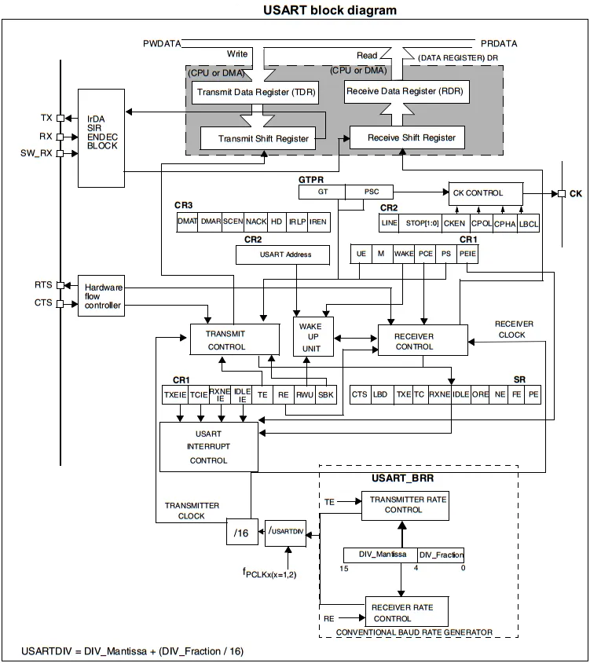

There is an address register for multi-processor communication mode. There exist a hardware data flow control unit to support this feature. And also an IrDA decoder circuitry, and interrupt control unit to generate various interrupt signals on different USART hardware events.
##### USART Data (Character) Packet
Word length may be selected as being either 8 or 9 bits by programming the M bit in the USART_CR1 register. Transmission and reception are driven by a common baud rate generator, the clock for each is generated when the enable bit is set respectively for the transmitter and receiver. The TX pin is in a low state during the start bit. It is in a high state during the stop bit.
An Idle character is interpreted as an entire frame of “1”s followed by the start bit of the next frame which contains data (The number of “1” ‘s will include the number of stop bits).
A Break character is interpreted on receiving “0”s for a frame period. At the end of the Break frame, the transmitter inserts either 1 or 2 stop bits (logic “1” bit) to acknowledge the start bit.
 

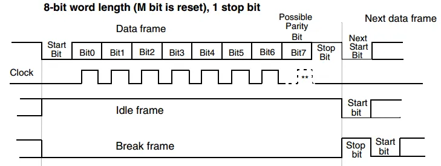

##### USART Transmitter
The USART transmitter can send data words of either 8 or 9 bits depending on the M bit status. When the transmit enable bit (TE) is set, the data in the transmit shift register is shifted out to the TX pin, and the corresponding clock pulses are output on the CK pin (for synchronous mode).
During a USART transmission, data shifts out the least significant bit first on the TX pin. Every character is preceded by a start bit, which is a logic level low for a one-bit period. The character is terminated by a configurable number of stop bits. The following stop bits are supported by USART: 0.5, 1, 1.5, and 2 stop bits.
Note
•	The TE bit should not be reset during the transmission of data. Resetting the TE bit during the transmission will corrupt the data on the TX pin as the baud rate counters will get frozen. The current data being transmitted will be lost.
•	An idle frame will be sent after the TE bit is enabled.
USART Data Transmission Steps (Procedure)
1.	Enable the USART by writing the UE bit in USART_CR1 register to 1.
2.	Program the M bit in USART_CR1 to define the word length.
3.	Program the number of stop bits in USART_CR2.
4.	Select DMA to enable (DMAT) in USART_CR3 if Multi buffer Communication is to take place. Configure the DMA register as explained in multi-buffer communication.
5.	Select the desired baud rate using the USART_BRR register.
6.	Set the TE bit in USART_CR1 to send an idle frame as the first transmission.
7.	Write the data to send in the USART_DR register (this clears the TXE bit). Repeat this for each data to be transmitted in case of a single buffer.
8.	After writing the last data into the USART_DR register, wait until TC=1. This indicates that the transmission of the last frame is complete. This is required for instance when the USART is disabled or enters the Halt mode to avoid corrupting the last transmission.
When a transmission is taking place, a write instruction to the USART_DR register stores the data in the TDR register and which is copied in the shift register at the end of the current transmission.
When no transmission is taking place, a write instruction to the USART_DR register places the data directly in the shift register, the data transmission starts, and the TXE bit is immediately set.
If a frame is transmitted (after the stop bit) and the TXE bit is set, the TC bit goes high. An interrupt is generated if the TCIE bit is set in the USART_CR1 register. After writing the last data into the USART_DR register, it is mandatory to wait for TC=1 before disabling the USART or causing the microcontroller to enter the low-power mode.
The TC bit is cleared by the following software sequence:
1.	A read from the USART_SR register
2.	A write to the USART_DR register
The TC bit can also be cleared by writing a ‘0’ to it.
The timing sequence diagram down below will show you the exact behavior of the USART transmitter hardware, the TC bit, and the TXE flag bit.
 
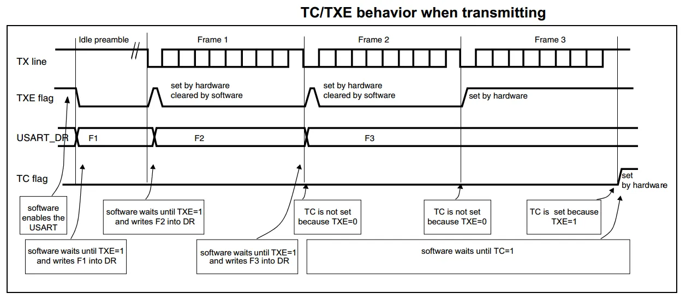
##### USART Receiver
The USART can receive data words of either 8 or 9 bits depending on the M bit in the USART_CR1 register. In the USART, the start bit is detected when a specific sequence of samples is recognized.
This sequence is: 1 1 1 0 X 0 X 0 X 0 0 0 0. If the sequence is not complete, the start bit detection aborts and the receiver returns to the idle state (no flag is set) where it waits for a falling edge.
 
The receiver clock is x16 times faster than the transmitter clock which is generated by the same baud rate generator. Which guarantees more samples (typically 16) per bit-time duration. The diagram below shows you the start bit detection and the exact conditions that must be met to validate a true start bit.
 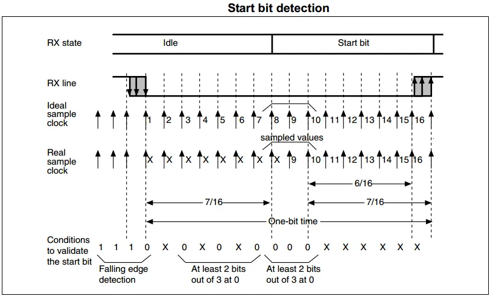
During a USART reception, data shifts in the least significant bit first through the RX pin. In this mode, the USART_DR register consists of a buffer (RDR) between the internal bus and the received shift register.
USART Data Reception Steps (Procedure)
1.	Enable the USART by writing the UE bit in the USART_CR1 register to 1.
2.	Program the M bit in USART_CR1 to define the word length.
3.	Program the number of stop bits in USART_CR2.
4.	Select DMA enable (DMAR) in USART_CR3 if multi-buffer communication is to take place. Configure the DMA register as explained in multi-buffer communication. STEP 3
5.	Select the desired baud rate using the baud rate register USART_BRR
6.	Set the RE bit USART_CR1. This enables the receiver which begins searching for a start bit.
When a character is received, The RXNE bit is set. It indicates that the content of the shift register is transferred to the RDR. In other words, data has been received and can be read (as well as its associated error flags). An interrupt is generated if the RXNEIE bit is set.
In multibuffer, RXNE is set after every byte received and is cleared by the DMA read to the Data Register. In single buffer mode, clearing the RXNE bit is performed by software read to the USART_DR register. The RXNE flag can also be cleared by writing a zero to it. The RXNE bit must be cleared before the end of the reception of the next character to avoid an overrun error.
Note
The RE bit should not be reset while receiving data. If the RE bit is disabled during the reception, the reception of the current byte will be aborted.

##### Fractional Baud Rate Generator (BRG)
The baud rate for the receiver and transmitter (RX and TX) are both set to the same value as programmed in the Mantissa and Fraction values of USARTDIV.

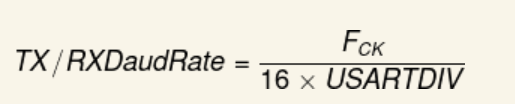
 
USARTDIV is an unsigned fixed-point number that is coded on the USART_BRR register.FCK is the input clock to the USART peripheral.

The baud rate counters are updated with the new value of the Baud registers after a write to USART_BRR. Hence the Baud rate register value should not be changed during communication.

>
>	The lower the CPU clock the lower will be the accuracy for a particular Baud rate. The upper limit of the achievable baud rate can be fixed with this data.
>	Only USART1 is clocked with PCLK2 (72 MHz max). 
>   
>Other USARTs are clocked with PCLK1 (36 MHz max).

Example table from the datasheet for the error (percentage) in the baud rate at different rates with different clock frequencies for comparison.
The (Error%) is defined as (Calculated Baud Rate – Desired Baud Rate) / Desired Baud Rate.
 
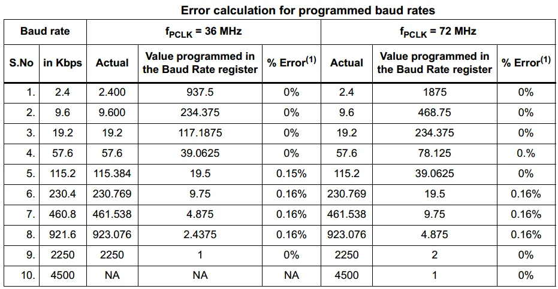
##### USART Parity Control

Parity control (generation of parity bit in transmission and parity checking in reception) can be enabled by setting the PCE bit in the USART_CR1 register. Depending on the frame length defined by the M bit, the possible USART frame formats are as listed in the table down below.

 

- Even parity: the parity bit is calculated to obtain an even number of “1s” inside the frame made of the 7 or 8 LSB bits (depending on whether M is equal to 0 or 1) and the parity bit.
- Odd parity: the parity bit is calculated to obtain an odd number of “1s” inside the frame made of the 7 or 8 LSB bits (depending on whether M is equal to 0 or 1) and the parity bit.

##### USART Multi-Processor Communication
There is a possibility of performing multiprocessor communication with the USART (several USARTs connected in a network). For instance, one of the USARTs can be the master, its TX output is connected to the RX input of the other USART. The others are slaves, their respective TX outputs are logically ANDed together and connected to the RX input of the master.
In multiprocessor configurations it is often desirable that only the intended message recipient should actively receive the full message contents, thus reducing redundant USART service overhead for all non-addressed receivers.
The non-addressed devices may be placed in mute mode by means of the muting function.
In mute mode:
- None of the reception status bits can be set.
- All the receive interrupts are inhibited.
- The RWU bit in the USART_CR1 register is set to 1. RWU can be controlled automatically by hardware or written by the software under certain conditions.
 
The USART can enter or exit from mute mode using one of two methods, depending on the WAKE bit in the USART_CR1 register:

- Idle Line detection if the WAKE bit is reset,
- Address Mark detection if the WAKE bit is set.
IDLE Line Detection (WAKE=0)

The USART enters mute mode when the RWU bit is written to 1. It wakes up when an Idle frame is detected. Then the RWU bit is cleared by hardware but the IDLE bit is not set in the USART_SR register. RWU can also be written to 0 by software.

 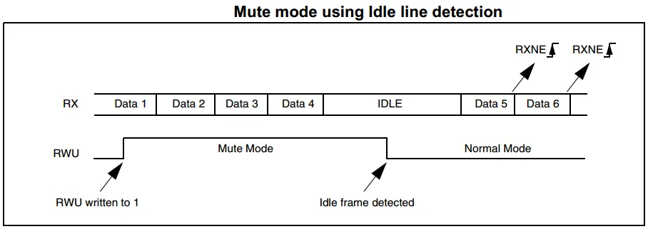

Address Mark Detection (WAKE=1)
In this mode, bytes are recognized as addresses if their MSB is a ‘1’ else they are considered as data. In an address byte, the address of the targeted receiver is put on the 4 LSB. 

This 4-bit word is compared by the receiver with its own address which is programmed in the ADD bits in the USART_CR2 register.
The USART enters mute mode when an address character is received which does not match its programmed address. In this case, the RWU bit is set by hardware. 
The RXNE flag is not set for this address byte and no interrupt nor DMA request is issued as the USART would have entered the mute mode.
It exits from mute mode when an address character is received which matches the programmed address. Then the RWU bit is cleared and subsequent bytes are received normally. 
The RXNE bit is set for the address character since the RWU bit has been cleared.
The RWU bit can be written to 0 or 1 when the receiver buffer contains no data (RXNE=0 in the USART_SR register). Otherwise, the write attempt is ignored.

 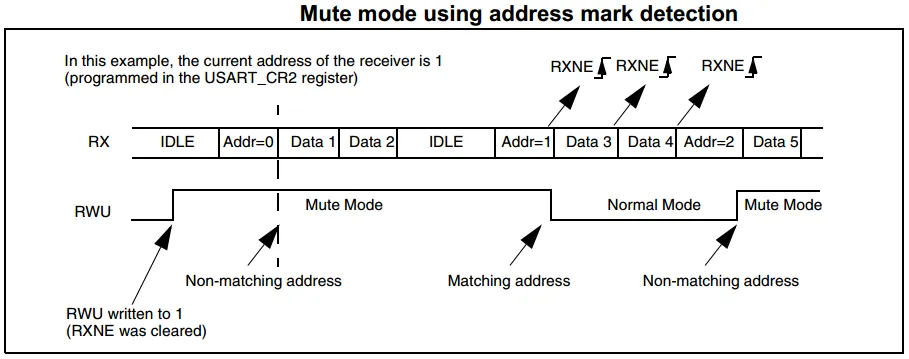

##### USART Synchronous Communication
The synchronous mode is selected by writing the CLKEN bit in the USART_CR2 register to 1. In synchronous mode, the following bits must be kept clear (0):
•	LINEN bit in the USART_CR2 register,
•	SCEN, HDSEL, and IREN bits in the USART_CR3 register.
The USART allows the user to control bidirectional synchronous serial communication in master mode. The CK pin is the output of the USART transmitter clock. No clock pulses are sent to the CK pin during the start bit and stop bit. Depending on the state of the LBCL bit in the USART_CR2 register clock pulses will or will not be generated during the last valid data bit (address mark). The CPOL bit in the USART_CR2 register allows the user to select the clock polarity, and the CPHA bit in the USART_CR2 register allows the user to select the phase of the external clock.

 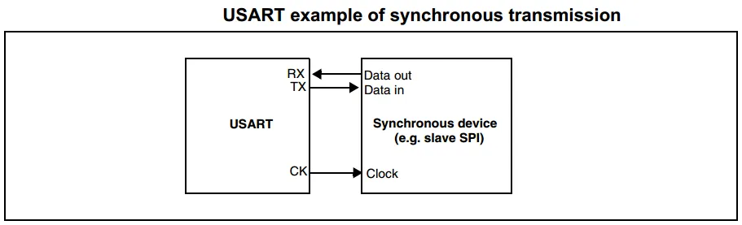

During IDLE, preamble, and send break, the external CK clock is not activated. In synchronous mode, the USART transmitter works exactly like in asynchronous mode. But as CK is synchronized with TX (according to CPOL and CPHA), the data on TX is synchronous.
In this mode, the USART receiver works in a different manner compared to the asynchronous mode. If RE=1, the data is sampled on CK (rising or falling edge, depending on CPOL and CPHA), without any oversampling. A setup and a hold time must be respected (which depends on the baud rate: 1/16 bit time).

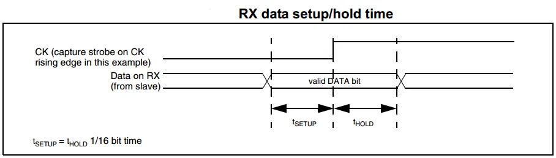 

The CK pin works in conjunction with the TX pin. Thus, the clock is provided only if the transmitter is enabled (TE=1) and data is being transmitted (the data register USART_DR has been written). This means that it is not possible to receive synchronous data without transmitting data.

##### USART Single-Wire (Half-Duplex) Communication

The single-wire half-duplex mode is selected by setting the HDSEL bit in the USART_CR3 register. In this mode, the following bits must be kept clear (0):
LINEN and CLKEN bits in the USART_CR2 register,
SCEN and IREN bits in the USART_CR3 register.
The USART can be configured to follow a single-wire half-duplex protocol. In single-wire half-duplex mode, the TX and RX pins are connected internally. The selection between half and full-duplex communication is made with a control bit ‘HALF DUPLEX SEL’ (HDSEL in USART_CR3).
As soon as HDSEL is written to 1:
- RX is no longer used.
- TX is always released when no data is transmitted. Thus, it acts as a standard IO in idle or in reception. It means that the IO must be configured so that TX is configured as floating input (or output high open-drain) when not driven by the USART.
Apart from this, the communications are similar to what is done in normal USART mode.

##### USART Errors

The USART hardware in STM32 microcontrollers is capable of detecting 4 errors in operations. These error signals are as follows.
3.10.1 Overrun Error
An overrun error occurs when a character is received when RXNE has not been reset. Data can not be transferred from the shift register to the RDR register until the RXNE bit is cleared.
The RXNE flag is set after every byte received. An overrun error occurs if the RXNE flag is set when the next data is received or the previous DMA request has not been serviced. When an overrun error occurs:
- The ORE bit is set.
- The RDR content will not be lost. The previous data is available when a read to USART_DR is performed.
- The shift register will be overwritten. After that point, any data received during the overrun is lost.
- An interrupt is generated if either the RXNEIE bit is set or both the EIE and DMAR bits are set.
- The ORE bit is reset by a read to the USART_SR register followed by a USART_DR register read operation.
- The ORE bit, when set, indicates that at least 1 data has been lost. There are two possibilities:
  + if RXNE=1, then the last valid data is stored in the receive register RDR and can be read.

If RXNE=0, then it means that the last valid data has already been read and thus there is nothing to be read in the RDR. This case can occur when the last valid data is read in the RDR at the same time as the new (and lost) data is received. It may also occur when the new data is received during the reading sequence (between the USART_SR register read access and the USART_DR read access).

###### Noise Error

Over-sampling techniques are used (except in synchronous mode) for data recovery by discriminating between valid incoming data and noise.

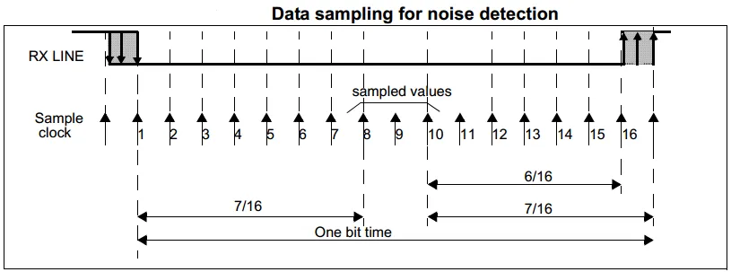 

When noise is detected in a frame:
- The NE is set at the rising edge of the RXNE bit.
- The invalid data is transferred from the Shift register to the USART_DR register.
- No interrupt is generated in the case of single-byte communication. However, this bit rises at the same time as the RXNE bit which itself generates an interrupt. In the case of multi-buffer communication, an interrupt will be issued if the EIE bit is set in the USART_CR3 register.
The NE bit is reset by a USART_SR register read operation followed by a USART_DR register read operation.

###### Framing Error

A framing error is detected when: The stop bit is not recognized on reception at the expected time, following either a desynchronization or excessive noise.
When the framing error is detected:
- The FE bit is set by hardware
- The invalid data is transferred from the Shift register to the USART_DR register.
- No interrupt is generated in the case of single-byte communication. However, this bit rises at the same time as the RXNE bit which itself generates an interrupt. In the case of multi-buffer communication, an interrupt will be issued if the EIE bit is set in the USART_CR3 register.
The FE bit is reset by a USART_SR register read operation followed by a USART_DR register read operation.

###### Parity Check Error

When a parity error is detected in the received data frame, the PE bit is set and it’ll fire an interrupt if it’s enabled. It can be set to even or odd parity depending on the application and whether it’s implemented in the communication or not. We won’t be using the parity check in all the tutorials and LABs dealing with USART.
##### USART Hardware Data Flow Control

It is possible to control the serial data flow between two devices by using the CTS input and the RTS output. RTS and CTS flow control can be enabled independently by writing respectively RTSE and CTSE bits to 1 (in the USART_CR3 register). The diagram below shows how to connect two devices in this mode.
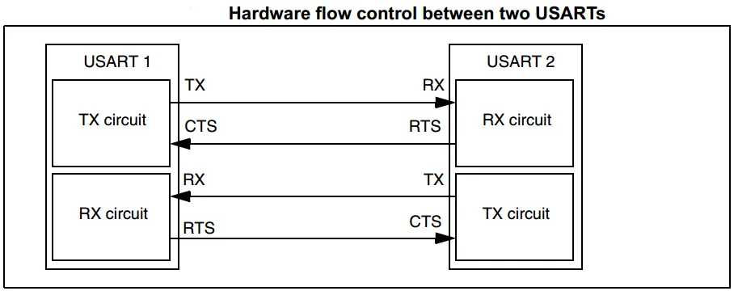
 
###### RTS Flow Control
If the RTS flow control is enabled (RTSE=1), then RTS is asserted (tied low) as long as the USART receiver is ready to receive new data. When the receive register is full, RTS is de-asserted, indicating that the transmission is expected to stop at the end of the current frame.

###### CTS Flow Control
If the CTS flow control is enabled (CTSE=1), then the transmitter checks the CTS input before transmitting the next frame. If CTS is asserted (tied low), then the next data is transmitted (assuming that data is to be transmitted, in other words, if TXE=0), else the transmission does not occur. When CTS is de-asserted during a transmission, the current transmission is completed before the transmitter stops.

###### LIN Mode
The LIN (Local Interconnection Network) Mode is selected by setting the LINEN bit in the USART_CR2 register.
In LIN mode, the following bits must be kept clear (0):
•	STOP[1:0], CLKEN in the USART_CR2 register.
•	SCEN, HDSEL and IREN in the USART_CR3 register.

##### LIN Data Transmission

The same procedure for USART transmission discussed earlier applies to LIN Master transmission with the following differences:
•	Clear the M bit to configure 8-bit word length.
•	Set the LINEN bit to enter LIN mode. In this case, setting the SBK bit sends 13 ‘0’ bits as a break character. Then a bit of value ‘1’ is sent to allow the next start detection.

###### LIN Data Reception

A break detection circuit is implemented in the USART. The detection is totally independent of the normal USART receiver. A break can be detected whenever it occurs, during idle state or during a frame.
When the receiver is enabled (RE=1 in USART_CR1), the circuit looks at the RX input for a start signal. The method for detecting start bits is the same when searching break characters or data. After a start bit has been detected, the circuit samples the next bits exactly like for the data (on the 8th, 9th and 10th samples). If 10 (when the LBDL = 0 in USART_CR2) or 11 (when LBDL=1 in USART_CR2) consecutive bits are detected as ‘0’, and are followed by a delimiter character, the LBD flag is set in USART_SR. If the LBDIE bit=1, an interrupt is generated.
Before validating the break, the delimiter is checked for as it signifies that the RX line has returned to a high level. If a ‘1’ is sampled before the 10 or 11 have occurred, the break detection circuit cancels the current detection and searches for a start bit again.

###### IrDA Mode

The IrDA mode is selected by setting the IREN bit in the USART_CR3 register. In IrDA mode, the following bits must be kept clear (0):
•	LINEN, STOP, and CLKEN bits in the USART_CR2 register,
•	SCEN and HDSEL bits in the USART_CR3 register.
The IrDA SIR physical layer specifies the use of a Return to Zero, an Inverted (RZI) modulation scheme that represents logic 0 as an infrared light pulse.
The SIR Transmit encoder modulates the Non-Return to Zero (NRZ) transmit bitstream output from USART. The output pulse stream is transmitted to an external output driver and infrared LED. USART supports only bit rates up to 115.2Kbps for the SIR ENDEC. In normal mode, the transmitted pulse width is specified as 3/16 of a bit period.
The SIR receive decoder demodulates the return-to-zero bitstream from the infrared detector and outputs the received NRZ serial bit stream to USART. The decoder input is normally HIGH (marking state) in the idle state. The transmit encoder output has the opposite polarity to the decoder input. A start bit is detected when the decoder input is low.
 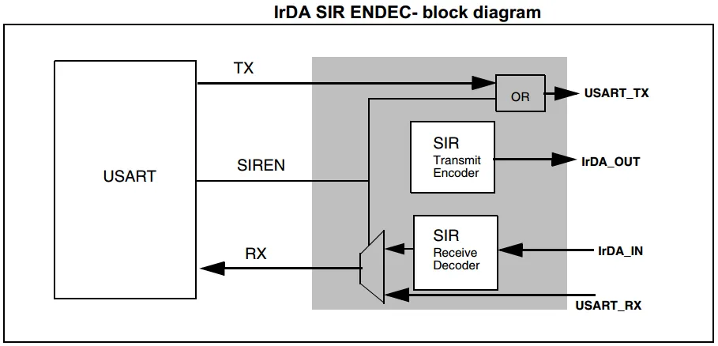
________________________________________
### STM32 USART Mode Configuration   
To get an idea of what configuration modes are supported in which USART module in the target MCU you’re using, you’ll have to check out the datasheet for it. You’ll find a table like the one shown below, highlighting which modes are supported in each USART module.
 
For the STM32F103C8 microcontroller in the blue pill board we’re using, there are only 3 USARTs.
For the STM32L432KC microcontroller in the Nucleo32-L432KC board we’re using, there are only 3 USARTs.
________________________________________
### USART Interrupts   
The USART interrupt events are connected to the same interrupt vector. So the USART fires a single interrupt signal regardless of the source of it. The software will have to detect it.
•	During transmission: Transmission Complete, Clear to Send or Transmit Data Register empty interrupt.
•	While receiving: Idle Line detection, Overrun error, Receive Data register not empty, Parity error, LIN break detection, Noise Flag (only in multi buffer communication), and Framing Error (only in multi buffer communication).
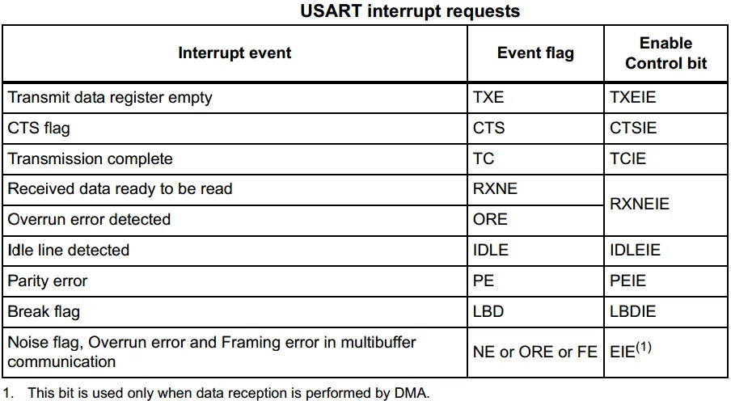 
These events generate an interrupt if the corresponding Enable Control Bit is set. The diagram down below shows this interrupt signals mapping to only one request line.
 
________________________________________
### USART Configuration In CubeMX   
 
In the next few tutorials, we’ll be doing some practical LABs to implement UART receiver/transmitter code examples. In which we’ll be using the CubeMX software tool to configure the USART hardware. Therefore, in this section, I’ll introduce to you the features and options that can be configured within CubeMX GUI for USART modules.
Here is the configuration tab for the USART module in CubeMX
 
And here are the possible modes for USART that can be configured.
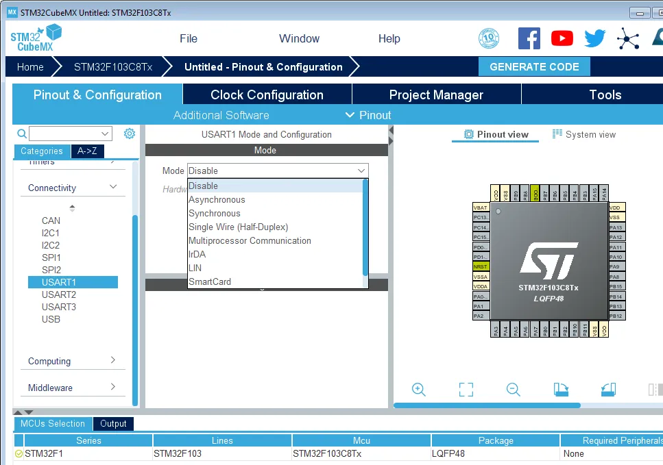 
Let’s pick the asynchronous mode for example. You’ll find that now we’re able to set the baud rate, stop bits, parity control option, and other parameters. You can also enable/disable the USART data flow control. And USART interrupts from the NVIC interrupt controller parameters tab.
 
 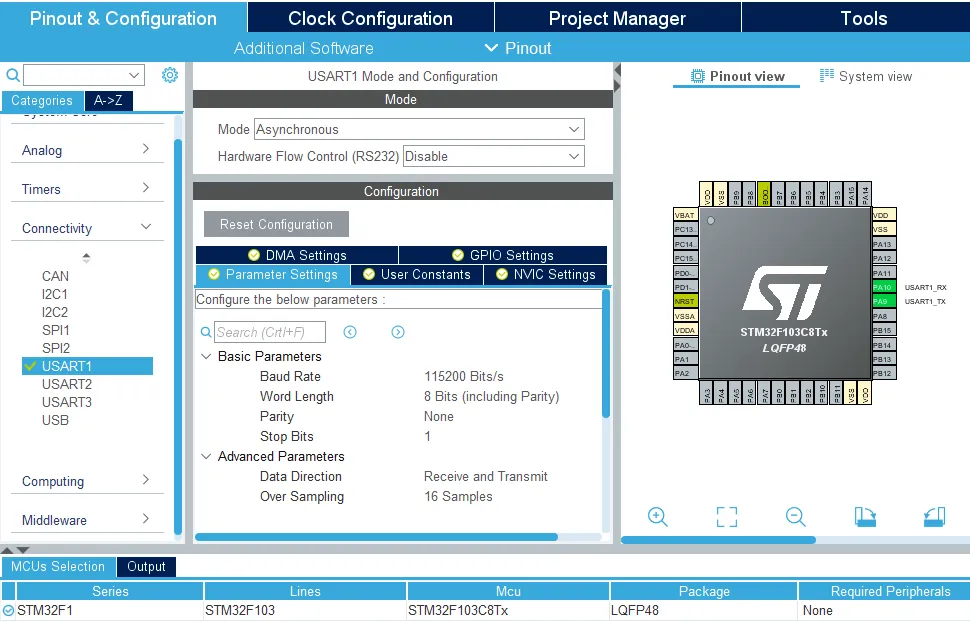
________________________________________
 
 
And That’s It For This Tutorial .. In The Next Few Tutorials, We’ll Do Some LABs To Use The USART Serial Communication In Practice. So, Get Ready For That! And Please, Consider Supporting The Content By SHARING It On Socials Or Via Patreon.
 
 
